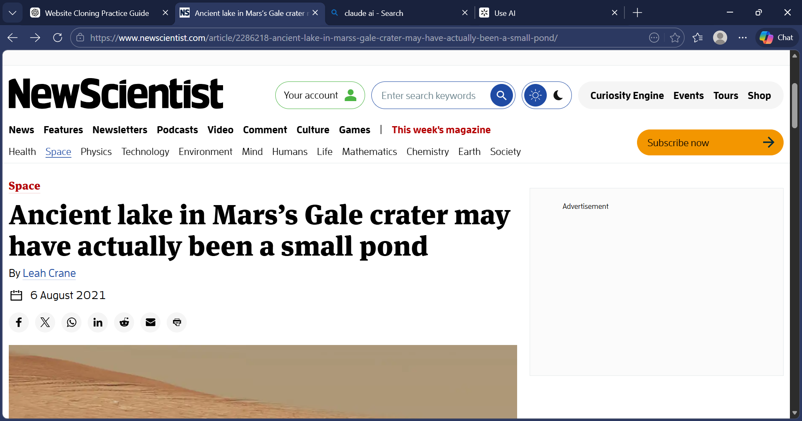

# NewScientist article page clone

 
A HTML/CSS landing page from [NewScientist Article](https://www.newscientist.com/article/2286218-ancient-lake-in-marss-gale-crater-may-have-actually-been-a-small-pond/)

## Built with 

- HTML
- CSS

## Live Demo

[Link to site](https://eagles-eye1.github.io/New-Scientist/scientist.html)

## Authors

 👤  **Author**
    Powell Orok
 - Github: [Eagleseye1] [https://github.com/Eagles-eye1]

## 🤝 Contributing

Contributions, issues, and feature requests are welcome!

Feel free to check the [issues page](https://github.com/Eagles-eye1/issues).

## Show your support

Give a ⭐️ if you like this project!

